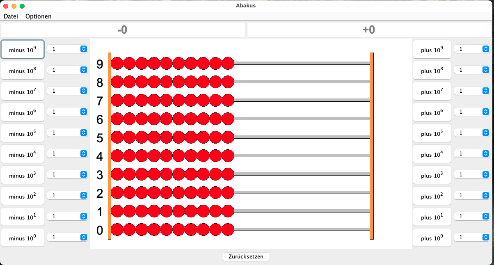

# ABacusDE
[English](README.md) | [Deutsch]  
Ein Java-basierter Emulator für einen traditionellen deutschen Abakus.




## Funktionen
* **Authentisches Erlebnis**: Ein typisch deutscher Abakus mit 100 Kugeln auf 10 Stäben, der traditionellen mathematischen Regeln und Logik folgt.
* **Duale Ergebnisanzeige**: Im Gegensatz zu einem physischen Abakus zeigt dieser Emulator oben zwei Arten von Ergebnissen an:
    * Positive Ergebnisse: Die Summe der aktiven Kugeln auf der rechten Seite.
    * Negative Ergebnisse: Berechnet nach Computer-Logik (z. B. wird -1 durch 9 aktive Kugeln rechts und 1 inaktive Kugel links dargestellt).
* Audio-Feedback: Bei jeder Bewegung eienr Kugel ertönt ein realistisches Klackgeräusch.

## Voraussetzungen
* **Java**: 21+
* **Maven Wrapper**: Im Projekt enthalten (`./mvnw`)

## Installation
Um das Programm sofort zu installieren, ohne es selbst zu kompilieren:
1. Lade die entsprechende Release-Version für dein Betriebssystem herunter (z. B. abacus-1.0.dmg für MacOS X).
2. Doppelklicke auf den Installer und folge den Anweisungen auf dem Bildschirm

## Kompilieren aus dem Quellcode
Um das Projekt manuell zu kompilieren und die JAR-Datei zu erstellen:
```bash
./mvnw clean package
```

## Bedienung:
* **Bewegung**: Nutze die Schaltflächen **plus 10ᵖ** or **minus 10ᵖ**, um die Kugeln zu bewegen; p ist hierbei der Exponent von 10 und entspricht gleichzeitig der Nummeriungen einzelner Stäbe.
    * Example: Ein Klick auf `10⁰` fügt eine Kugel mit dem Wert 1 hinzu oder entfernt sie.
    * Example: Ein Klick auf `10⁹` fügt eine Kugel mit dem Wert 1,000,000,000 hinzu oder entfernt sie.
* **Anpassung**: Über das Menü **Options** kannst du die "Ergebnisse -" oder die "Nummerierungen ausblenden".
* **Beenden**: Wähle **Datei > Schließen**, um das Programm zu beenden.

## Lizenz
Veröffentlicht unter der MIT-Lizenz. Weitere Informationen finden Sie in der [englischen Originalfassung](LICENSE) oder der [deutschen Leseabschrift](LIZENZ).

## Mitwirkende & Copyright
Copyright (c) 2026 Ruan Yue Xin (xin81)
