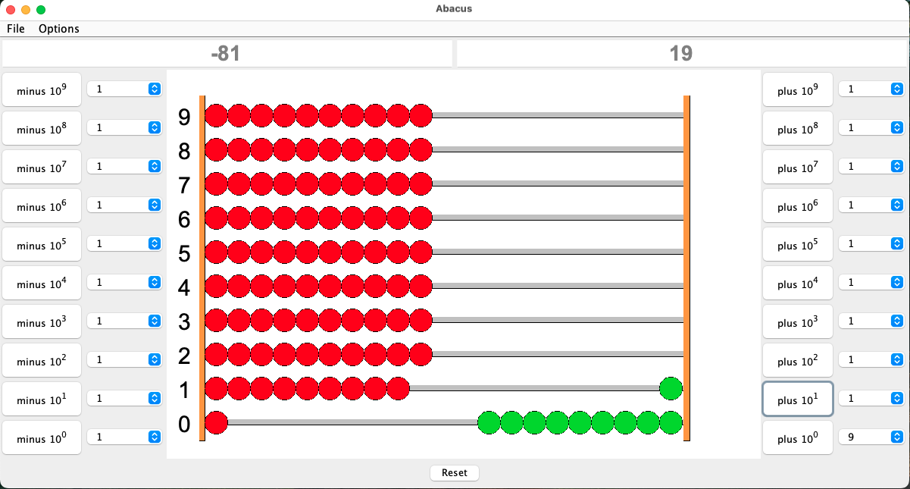

# ABacusDE  
[English] | [Deutsch](LIESMICH.md)  
A Java-based emulator for a traditional German abacus.





## Features  
* **Authentic Experience**: A typical German abacus with 100 beads across 10 rods, following traditional mathematical rules and logic.
* **Dual Results Display**: Unlike a physical abacus, this emulator shows two types of results at the top:
    * **Positive Results**: The sum of active beads on the right side.
    * **Negative Results**: Calculated using computer-like logic (e.g., -1 is represented by 9 active beads on the right and 1 inactive bead on the left).
* **Audio Feedback**: Realistic clicking sounds trigger every time you move a bead.

## Requirements  
* **Java**: 21+
* **Maven Wrapper**: Included in the project (`./mvnw`)

## Platform Compatibility
This software is automatically built and packaged via GitHub Actions for the following platforms:

- **macOS**: Universal support for Apple Silicon and Intel (Built on macOS 15/26).
- **Windows**: Windows 11 (x64).
- **Linux**: Ubuntu 24.04/26.04 LTS (.deb package).

**Note for Users:**
  As an independent developer, I personally verify the **macOS** version on my own Intel iMac. The Windows and Linux installers are generated using standard automated tools. If you encounter any issues on these platforms, please open a GitHub Issue so I can investigate!

  This is a personal hobby project. Please understand that I am unable to provide professional support or guarantee compatibility across all platforms. 

## Installation  
To install immediately without compiling from source:
1. Download the latest release for your operating system (for example, abacus-1.0.dmg on a MacOS X machine)
2. Double-click the installer and follow the on-screen instructions.

## Building from Source  
To compile the project and generate the JAR manually:
```bash
./mvnw clean package
```

## Usage  
* **Movement**: Use the buttons labeled **Plus 10ᵖ** or **Minus 10ᵖ** to move beads; the small p denotes the power of 10 and also equals the numbering of each rod.
    * Example: Clicking `10⁰` adds/removes a bead with a value of 1.
    * Example: Clicking `10⁹` adds/removes a bead with a value of 1,000,000,000.
* **Customization**: Use the **Options** menu to toggle "Hide Results" or "Hide Numbering."
* **Exiting**: Select **File > Close** to end the program.

### MacOS X
You can launch this application in your terminal and set the application language beforehand. If you don't use the option --language, the default language will be German, unless your system language is English.
`/Applications/abacus.app/Contents/MacOS/abacus --language en` (to change the application language to english)

### Linux
You can launch this application in your terminal and set the application language beforehand. If you don't use the option --language, the default language will be German, unless your system language is English.
`/opt/abacus/bin/abacus --language en` (to change the application language to english)

### Windows
You can launch this application in your terminal and set the application language beforehand. If you don't use the option --language, the default language will be German, unless your system language is English.
`"C:\Program Files\abacus\abacus.exe --language en` (to change the application to english)

## Languages
Currently supporting English and  German (default).

## License  
Distributed under the MIT License. See [LICENSE](LICENSE) for more information.

## Credits & Copyright
* **Lead Developer**: Nguyen Viet Tan
* **Provider**: Ruan Yue Xin (xin81)
* Copyright (c) 2026 Ruan Yue Xin